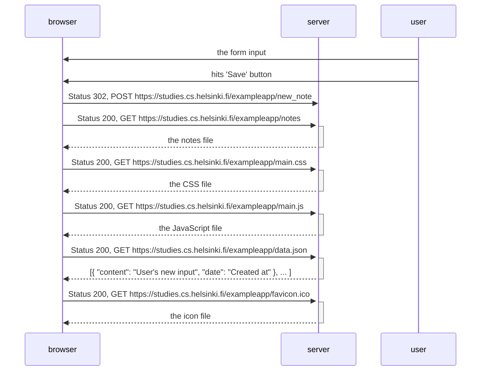

    

```mermaid
sequenceDiagram
    participant browser
    participant server
    participant user

    user->>browser: the form input

    user->>browser: hits 'Save' button

    browser->>server: Status 302, POST https://studies.cs.helsinki.fi/exampleapp/new_note
    activate server
        
    browser->>server: Status 200, GET https://studies.cs.helsinki.fi/exampleapp/notes
    activate server
    server-->>browser: the notes file
    deactivate server
    
    browser->>server: Status 200, GET https://studies.cs.helsinki.fi/exampleapp/main.css
    activate server
    server-->>browser: the CSS file
    deactivate server
    
    browser->>server: Status 200, GET https://studies.cs.helsinki.fi/exampleapp/main.js
    activate server
    server-->>browser: the JavaScript file
    deactivate server
        
    browser->>server: Status 200, GET https://studies.cs.helsinki.fi/exampleapp/data.json
    activate server
    server-->>browser: [{ "content": "User's new input", "date": "Created at" }, ... ]
    deactivate server    

    browser->>server: Status 200, GET https://studies.cs.helsinki.fi/exampleapp/favicon.ico
    activate server
    server-->>browser: the icon file
    deactivate server    
```